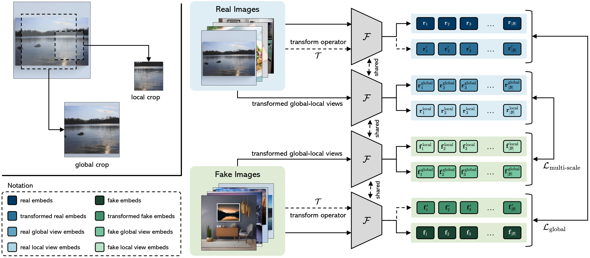

<div align="center">
  <h1>CoDE (Contrastive Deepfake Embeddings)</h1>
  <h2>Contrasting Deepfakes Diffusion via Contrastive Learning and Global-Local Similarities

  (ECCV 2024)
  </h2>
   
</div>

<br></br>
<p align="center">
  

</p> 

## Table of Contents

1. [Training Dataset](#training-dataset)
2. [Citation](#citation)

## Training Dataset 
[🎯 Project web page](https://aimagelab.github.io/CoDE/) |
[Paper](https://arxiv.org/pdf/2407.20337) |
[Dataset web page](https://aimagelab.ing.unimore.it/imagelab/page.asp?IdPage=57) |
[D<sup>3</sup> Test Set](https://ailb-web.ing.unimore.it/publicfiles/drive/elsa_dataset/d3_test.tar) |
[🤗 HuggingFace Dataset](https://huggingface.co/datasets/elsaEU/ELSA_D3) |
[🤗 HuggingFace Model](https://huggingface.co/aimagelab/CoDE) |

The Diffusion-generated Deepfake Detection (D<sup>3</sup>) Dataset is a comprehensive collection designed for large-scale deepfake detection. It includes 9.2 million generated images, created using four state-of-the-art diffusion model generators. Each image is generated based on realistic textual descriptions from the LAION-400M dataset.

- **Images**: 11.5 million images
- **Records**: 2.3 million records
- **Generators**: Stable Diffusion 1.4, Stable Diffusion 2.1, Stable Diffusion XL, and DeepFloyd IF
- **Aspect Ratios**: 256x256, 512x512, 640x480, 640x360
- **Encodings**: BMP, GIF, JPEG, TIFF, PNG

The D<sup>3</sup> dataset is part of the European Lighthouse on Secure and Safe AI (ELSA) project, which aims to develop effective solutions for detecting and mitigating the spread of deepfake images in multimedia content.

To try D<sup>3</sup> you can access it using

```python
from datasets import load_dataset
elsa_data = load_dataset("elsaEU/ELSA_D3", split="train", streaming=True)
```
The test set of D<sup>3</sup> is available at this link [D<sup>3</sup> Test Set](https://ailb-web.ing.unimore.it/publicfiles/drive/elsa_dataset/d3_test.tar) 

## Inference
Install the requirements by 
```bash
pip install requirements.txt
```

After downloading the test set of D<sup>3</sup> at the previous link, you can use the following code to load the dataset and run the inference on the CoDE model.

Substitute the path of the directories in ```CoDE_model/dataset_paths_d3.py```

```python
cd CoDE_model
python validate_d3.py --classificator_type "linear"
# options for classificator_type are ["linear", "knn", "svm"]
```
## Citation

Please cite with the following BibTeX:
```
@inproceedings{baraldi2024contrastive,
  title={{Contrasting Deepfakes Diffusion via Contrastive Learning and Global-Local Similarities}},
  author={Baraldi, Lorenzo and Cocchi, Federico and Cornia, Marcella and Baraldi, Lorenzo and Nicolosi, Alessandro and Cucchiara, Rita},
  booktitle={Proceedings of the European Conference on Computer Vision},
  year={2024}
}
```

## Acknowledgements
We acknowledge the CINECA award under the ISCRA initiative, for the availability of high-performance computing resources and support. This work has
been supported by the Horizon Europe project “European Lighthouse on Safe and Secure AI (ELSA)” (HORIZON-CL4-2021-HUMAN-01-03), 
co-funded by the European Union.

 &nbsp;&nbsp; 


